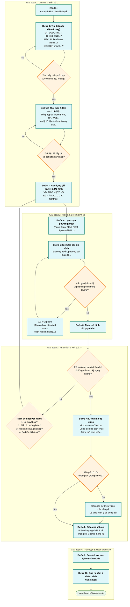

# DEMO

```mermaid
graph TD
    %% --- Định nghĩa Style cho các khối ---
    classDef buoc fill:#e0f7fa,stroke:#00796b,stroke-width:1.5px,color:#000
    classDef quyetDinh fill:#fff3e0,stroke:#ef6c00,stroke-width:1.5px,color:#000
    classDef ketThuc fill:#e8f5e9,stroke:#2e7d32,stroke-width:1.5px,color:#000

    %% --- Giai đoạn 1: Dữ liệu & Biến số ---
    subgraph "Giai đoạn 1: Dữ liệu & Biến số 🔬"
        A["Bắt đầu:<br/>Xác định khái niệm lý thuyết"]:::buoc
        A --> B["<b>Bước 1: Tìm biến đại diện (Proxy)</b><br/>DT: EGDI, NRI...?<br/>IC: HCI, R&D...?<br/>AIAC: AI Readiness Index...?<br/>EG: GDP growth...?"]:::buoc
        B --> C{"Tìm thấy biến phù hợp<br/>& có đủ dữ liệu không?"}:::quyetDinh
        C -- No --> B
        C -- Yes --> D["<b>Bước 2: Thu thập & làm sạch dữ liệu</b><br/>Tổng hợp từ World Bank, UN, WEF...<br/>Xử lý dữ liệu thiếu (missing data)"]:::buoc
        D --> E{"Dữ liệu đã đầy đủ<br/>và đáng tin cậy chưa?"}:::quyetDinh
        E -- No --> D
        E -- Yes --> F
    end

    %% --- Giai đoạn 2: Mô hình & Kiểm định ---
    subgraph "Giai đoạn 2: Mô hình & Kiểm định 📊"
        F["<b>Bước 3: Xây dựng giả thuyết & Mô hình</b><br/>VD: AIAC = f(DT, IC)<br/>EG = f(AIAC, DT, IC, Controls)"]:::buoc
        F --> G["<b>Bước 4: Lựa chọn phương pháp</b><br/>(Panel Data: FEM, REM, System GMM...)"]:::buoc
        G --> H["<b>Bước 5: Kiểm tra các giả định</b><br/>Đa cộng tuyến, phương sai thay đổi..."]:::buoc
        H --> I{"Các giả định có bị<br/>vi phạm nghiêm trọng không?"}:::quyetDinh
        I -- Yes --> J["Xử lý vi phạm<br/>(Dùng robust standard errors,<br/>chọn mô hình khác...)"]:::buoc
        J --> H
        I -- No --> K
    end

    %% --- Giai đoạn 3: Phân tích & Kết quả ---
    subgraph "Giai đoạn 3: Phân tích & Kết quả 💡"
        K["<b>Bước 6: Chạy mô hình hồi quy chính</b>"]:::buoc
        K --> L{"Kết quả có ý nghĩa thống kê<br/>& đúng dấu như kỳ vọng không?"}:::quyetDinh
        L -- No --> M{"<b>Phân tích nguyên nhân:</b><br/>1. Lý thuyết sai?<br/>2. Biến đo lường kém?<br/>3. Mô hình chưa phù hợp?<br/>4. Có biến bị bỏ sót?"}:::quyetDinh
        M --> F
        L -- Yes --> N["<b>Bước 7: Kiểm định độ vững</b><br/>(Robustness Checks)<br/>- Dùng biến đại diện khác<br/>- Dùng mô hình khác..."]:::buoc
        N --> O{"Kết quả có còn<br/>nhất quán (vững) không?"}:::quyetDinh
        O -- No --> P["Ghi nhận sự thiếu vững của kết quả<br/>và thảo luận lý do trong bài"]:::buoc
        P --> Q
        O -- Yes --> Q
    end

    %% --- Giai đoạn 4: Thảo luận & Hoàn thành ---
    subgraph "Giai đoạn 4: Thảo luận & Hoàn thành ✍️"
        Q["<b>Bước 8: Diễn giải kết quả</b><br/>Phân tích ý nghĩa kinh tế,<br/>không chỉ ý nghĩa thống kê"]:::buoc
        Q --> R["<b>Bước 9: So sánh với các nghiên cứu trước</b>"]:::buoc
        R --> S["<b>Bước 10: Đưa ra hàm ý chính sách<br/>và kết luận</b>"]:::buoc
        S --> T(["Hoàn thành bài nghiên cứu"]):::ketThuc
    end
```